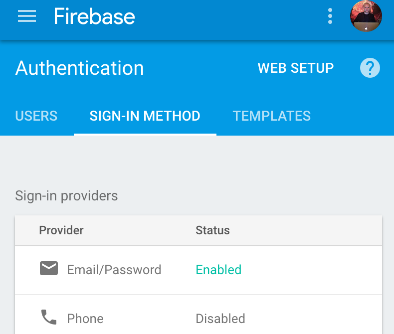

# Firebase Support

There is a version of Fiber with Firebase support available [here](https://react-native.shop/#fiber).
And you can check it out using expo [here](https://expo.io/@wcandillon/react-native-fiber-firebase).
In this guide, we aim to guide you in setting up the app under your own firebase account.
If you don't have one, you can create a firebase account [here](https://console.firebase.google.com).

## Using your own Firebase account

To use your own Firebase account for this account, please create a new project and enable email/password authentication.
To enable email/password authentication, go to `Authentication` from the left menu, then go to `Sign-in Methods` and enable the Email/password field.


From there you can go to `settings -> Add Firebase to your web app` and copy the given code snippet in `src/components/Firebase.js`.
This is how the beginning of the file looks like:

```js
// @flow
import * as firebase from "firebase";
import "firebase/firestore";

const config = {
    apiKey: "...",
    authDomain: "...",
    databaseURL: "...",
    projectId: "...",
    storageBucket: "",
    messagingSenderId: "..."
};
```

You also need to enable the Cloud Firestore database as seen in the screenshot below.


## Using indexes

Fiber is using Cloud Firestore indexes.
You can learn about Cloud Firestore indexes in the official [Firebase documentation](https://firebase.google.com/docs/firestore/query-data/indexing).
Last step, you need to deploy the database index.
The project identifier to deploy to is set in `.firebaserc`.
You need to change the project identifier to your own project identifier.
Beware that the project name and the project identifier are two different values (that can sometimes be the same).

In your project folder, run the following commands:

```
$(npm bin)/firebase login
$(npm bin)/firebase deploy
```

Below is how your index tab should look like after deployment.


Et voilà! You are up and running with your own Firebase backend.
